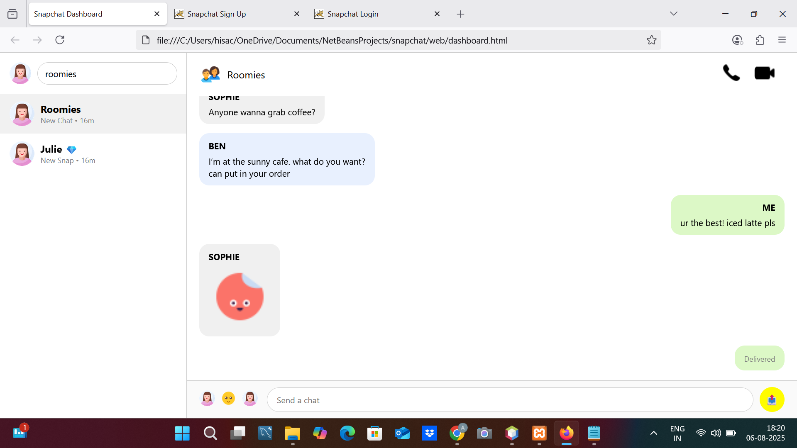
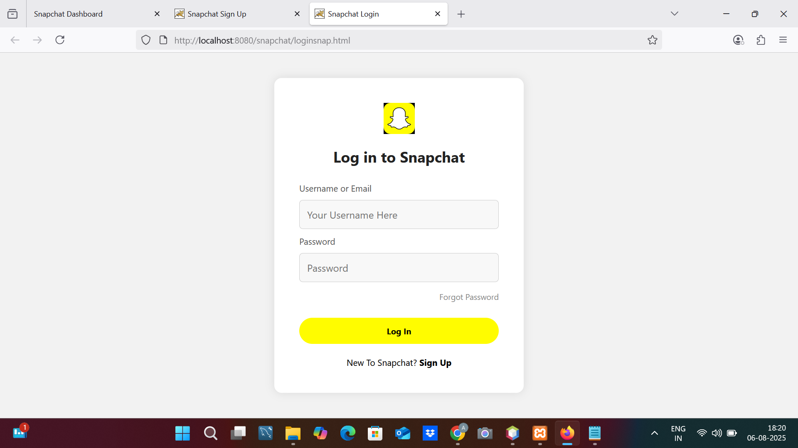
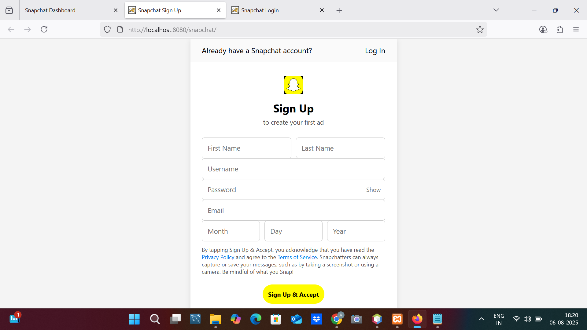

# 📸 Snapchat Web Clone UI

This project is a **front-end clone of Snapchat Web** – built using pure **HTML**,**CSS**,JAVASCRIPT, and MYSQL  to replicate the chat dashboard and user interface closely matching the official [web.snapchat.com](https://web.snapchat.com/).

---
## 🔥 Features

- 👤 Registration Page (Styled like Snapchat Ads sign-up)
- 🔐 Login Page (Clean and minimal)
- 💬 Dashboard Chat Interface (Right-side chat view)
- 🧑‍🤝‍🧑 Friends List Sidebar with avatars
- 📷 Icons for calling, video chat, emoji, and message sending
- 🎨 Responsive layout with realistic look and feel
---
## 📁 Folder Structure

snapchat-clone/
├── index.html # Registration page
├── loginsnap.html # Login page
├── dashboard.html # Snapchat-like dashboard UI
├── style.css # Common styling
├── login.css # Login page styling
├── /assets # Icons and profile avatars

---

## 📷 Screenshots

### 🟡 Dashboard UI  

### 🔵 Login Page  

### 🔵 Signup Page  
 

---

## 🚀 Getting Started

1. Clone this repository:
git clone https://github.com/aishwaryash775/Snapchat-clone-/tree/main/snapchat

2. Open `index.html` or `dashboard.html` in your browser.
3. You're ready to go!

> 📌 No backend or real-time functionality — this is a front-end UI/UX practice project.

---
## 💡 Future Scope (Optional Ideas)

- Add backend using Java + Servlet or PHP + MySQL
- Use JavaScript for live chat interactions
- Add login authentication
---
## 🙌 Author

**Aishwarya Santosh Shinde**  
_Computer Engineering Student | FULL STACK JAVA Enthusiast | Placement Ready 🚀_

---

## 🌟 Show Your Support

If you liked the project, feel free to ⭐ star it and fork for your own version!
